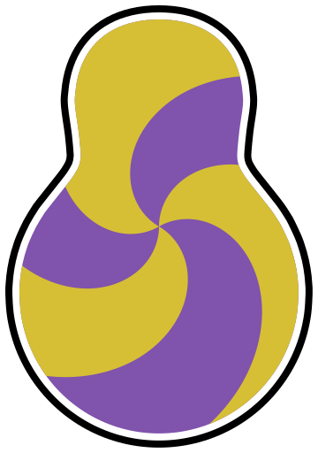

#  Big Replay

Big Replay is a tool for recording character positions in Big Walk and playing them back afterward. It runs alongside the game and pulls data by scraping memory - it's not a mod and doesn't change anything in the running game. To use it, download BigReplay-Setup.exe from GitHub and start the game. Afterward, your replays will be in a BigReplay folder in Documents.

## Layout

- `src/Replay.Format/` — replay file model + serializer + static game data (towers, gourd names).
- `src/GameAccess/` — read-only process access, manifest-backed memory readers, game model.
- `src/BigReplay.Recorder/` — CLI + shared capture loop: sample at N Hz, write replay file.
- `src/BigReplay.Desktop/` — native Windows GUI: watch for the game and record automatically.
- `schemas/` — JSON Schema for replay files (the contract the web front-end validates against).
- `index.html`, `map-view.js`, `gourd-receptacles.js`, `bigmap.jpeg` — root-level replay viewer and map assets.
- `atproto.js`, `oauth-client-metadata.json`, `vendor/` — Atmosphere sign-in and replay sharing for the viewer.
- `lexicons/` — atproto lexicons (`com.iameli.bigWalk.*`) for shared replays.
- `docs/` — format spec + the read-only/no-writes trust story.

## Status

Work in progress: read-only recorder with an automatic desktop UI + map-backed replay viewer.

## Requirements

- Windows x64. The self-contained desktop release needs no .NET installation.
- .NET SDK 10 to build from source or run the CLI.
- Big Walk (process name `Big Walk.exe`), running as the same user (no admin needed)
- Recorder must run on the **host** machine (Mirror host sees all 12 player bodies + all gourd state)

## Automatic recorder (Windows)

[Download the Big Replay installer](https://github.com/iameli/big-replay/releases/latest/download/BigReplay-Setup.exe)
and run **BigReplay-Setup.exe**. It installs for your Windows account and adds a
**Big Replay** Start menu shortcut. No administrator access or .NET installation is needed.

Select **Start Big Replay when I sign in to Windows** during setup to record
automatically after you sign in. This is optional and unchecked on the first
installation; your selection is remembered on upgrades. It starts the normal
recorder window, not a background service.

To change the setting, close Big Replay and rerun the installer. Unchecking the
option removes startup registration. You can also disable it through Windows
**Settings → Apps → Startup**.

Install updates over the existing installation. Setup will ask you to close a
running Big Replay first so it can finish saving. Uninstall through Windows
**Settings → Apps → Installed apps**; your **Documents/BigReplay** recordings are
kept. Program files live in `%LOCALAPPDATA%\Programs\Big Replay`.

The installer is not code-signed, so Windows may show an unknown-publisher or
SmartScreen warning.

Prefer a portable copy? [Download the Windows x64 ZIP](https://github.com/iameli/big-replay/releases/latest/download/BigReplay-win-x64.zip),
extract it, and run **BigReplay.exe**. Keep the bundled `manifest.json` beside it.
The portable ZIP does not register Windows startup automatically.

- It watches for Big Walk every two seconds, including when launched before the game.
- Once connected, it waits for players and captures at **10 Hz**.
- Replays go into **Documents/BigReplay**, using the Windows Documents location
  (including redirected/OneDrive Documents), with unique timestamped filenames.
- **Pause recording** finishes and saves the current file. **Resume recording**
  starts watching again and creates a fresh recording when the game is available.
- Closing the window finishes and saves; leave it open or minimized during a run.
- **Open recordings folder** opens the output folder in Explorer.
- If the game exits, the replay is finished and the app watches for the next launch.
- When a recorded walk drops to **zero players**, its replay is finished automatically.
  The app waits for players again and records the next walk in a new file, even if
  Big Walk stays open. Losing some players while others remain does not split.
- A missing/incompatible manifest or capture/save failure is shown in the window.
  Fix the problem and click **Resume recording**. Game startup/access failures retry
  automatically. Only one desktop instance runs per Windows login.

Captures use `.replay.json.gz.partial` while recording and become `.replay.json.gz`
only after successful finalization. Do not open the active file in the viewer.
Sessions with no player samples leave no replay. On a capture/save error, any partial
file is retained for investigation; it may not be playable. Forced termination,
Windows shutdown, or power loss can also leave an unfinished file.

**Split boundary:** the first zero-player sample after players have been recorded.
There is no grace period: even a brief observed drop to zero splits the file. The
final zero-player frame and its player-left/run-ended events remain in the old
replay. Waiting in menus before any players appear does not create empty replays.

### Run or package from source

From the repository root:

```powershell
dotnet run --project src/BigReplay.Desktop
```

Build a self-contained Windows x64 release:

```powershell
dotnet publish src/BigReplay.Desktop -c Release -r win-x64 --self-contained true -p:PublishSingleFile=true -p:IncludeNativeLibrariesForSelfExtract=true -p:DebugType=None -o dist/BigReplay
Compress-Archive -Path dist/BigReplay/* -DestinationPath dist/BigReplay-win-x64.zip -Force
```

To also build `dist/BigReplay-Setup.exe`, install
[Inno Setup 6](https://github.com/jrsoftware/issrc/releases/tag/is-6_7_1) and run after publishing:

```powershell
& "${env:ProgramFiles(x86)}\Inno Setup 6\ISCC.exe" /DAppVersion=0.1.0 installer/BigReplay.iss
```

Distribute the ZIP, not just the executable: the manifest is required. The bundled
manifest must match the installed game build; see [the trust notes](docs/trust.md).

The CLI remains available:

```powershell
dotnet run --project src/BigReplay.Recorder -- record manifest.json --out my-walk.replay.json.gz
```

Ctrl+C, game process exit, or a recorded walk dropping to zero players finishes the
CLI's single output file. Use the desktop app to keep watching and automatically
record subsequent walks. Existing output files are never overwritten.

### Automated releases

Pushes to `next` run [Release Big Replay](https://github.com/iameli/big-replay/actions/workflows/release.yml):
build the solution on Windows with .NET 10, publish the self-contained x64 app, and
attach **BigReplay-Setup.exe** and **BigReplay-win-x64.zip** to a new commit-tagged
GitHub release marked **latest**. The installer is built with the Windows runner's
Inno Setup compiler. The download links above always select that latest release.

The same workflow deploys the viewer to [big-replay.iame.li](https://big-replay.iame.li/)
in a separate GitHub Pages job. It publishes the root viewer, map, synthetic
`sample.replay.json.gz`, `CNAME`, and the logo/browser icon assets listed in the
workflow; other recordings in the repository are not included. Repository Pages settings use
**GitHub Actions** as the build source, with the `github-pages` environment allowing
deployments from `next`.

`CNAME` contains `big-replay.iame.li`. Its DNS CNAME points to `iameli.github.io`,
and GitHub Pages is configured for that custom domain with HTTPS enforced.

New pushes cancel superseded builds; only the current `next` commit is published.
The workflow can also be run manually from the Actions page with `next` selected.
It uses GitHub's built-in token; no separate release secret is required.

### Logo and icons

`logo.svg` is the source artwork, used directly in the viewer and this README.
`favicon.ico` contains ten sizes from 16 to 256 pixels and is shared by the browser
fallback, Windows executable/window, installer, Start menu shortcut, and Installed
apps entry. The recorder header and installer wizard also display the logo.
The viewer supplies an SVG favicon, Apple touch icon, 192/512-pixel home-screen
icons through `site.webmanifest`, and a logo for link previews.

Generated icons are checked in; normal builds need no image tools. After changing
`logo.svg`, regenerate them with [ImageMagick 7](https://imagemagick.org/script/download.php#windows)
and Microsoft Edge (or another Chromium browser). Chromium renders the SVG first
so clipping, reused paths, and outlines are preserved in the small raster icons.

```powershell
powershell -ExecutionPolicy Bypass -File scripts/generate-icons.ps1
# Or pass -MagickPath C:\path\to\magick.exe for a portable installation.
# Or pass -BrowserPath "C:\Program Files\Google\Chrome\Application\chrome.exe".
```

This preserves the artwork's proportions and transparent background, adding an
opaque background only for the Apple touch icon and installer sidebar.

## Replay map

Open the **[live Big Replay viewer](https://big-replay.iame.li/)** in a current
Chromium browser and choose or drop a `.replay.json.gz` / `.json` recording.
Chosen files are read locally in your browser and are only uploaded if you sign in
and choose **Share** (see [Sharing replays](#sharing-replays)).
[Try the bundled sample](https://big-replay.iame.li/?replay=sample.replay.json.gz).
The **Download Big Replay** button in the top-right of the controls opens the latest
release in a new tab without interrupting the viewer.
Click the **Big Replay** title or its info icon to open **About**. Close the dialog
with **Close**, Escape, or a click outside it.

Link previews use `og-card.jpg`, a centered **1200 × 630** crop of a completed
game screenshot with player trails. The JPEG is published with the viewer and
referenced by both Open Graph and Twitter large-image card metadata; app icons
remain unchanged.

For offline use, open the root `index.html` from a checkout. Keep
`atproto-record.js`, `source-video-sync.js`, `playback-layout.js`,
`mosaic-video.js`, `map-view.js`, `gourd-receptacles.js`, and `bigmap.jpeg`
beside it. No build or package install is needed.
Alternatively, serve the repository root with a static HTTP server and
open `/?replay=run1.replay.json.gz`.

Sharing needs the viewer served over HTTP. For local development run
`python3 scripts/serve.py` and open `http://127.0.0.1:8080/`; like the published
site, it answers `/<did>/<rkey>` paths with the viewer. Use `127.0.0.1`, not
`localhost`, so the development OAuth client can sign in.

Browser-saved calibration and display preferences are per origin; settings from
the former `github.io` site do not automatically transfer to the custom domain.

Drag the map to pan, scroll or pinch to zoom around the cursor, and use **Fit map**
to reset the view. Trackpad pinch has higher sensitivity than ordinary scrolling.
Playback starts paused; the timeline selects exact recorded frames. Playback and
the clock use recorded timestamps rather than assuming uniform samples.
Play/pause, the wide timeline, the current time, and playback-speed buttons sit in
an always-visible bar across the bottom of the window, below both the map and
sidebar. On narrow screens the speed buttons wrap onto a second row. The map and
sidebar resize above the bar, so it does not cover the map or its controls.

### AT Protocol record routes

A static `index.html` can point at an AT Protocol record through the URL hash:

```text
index.html#at://<repo>/<collection>/<record-key>
```

The client parses the AT URI, resolves handles and `did:plc`/`did:web` identities,
and requests the unauthenticated `com.atproto.repo.getRecord` endpoint from the
repository's PDS. `public.api.bsky.app` is the fallback when PDS discovery is not
available. While that route is active, an **AT Protocol record** section displays
the canonical URI, source host, CID, and JSON record value. Changing the hash loads
the new record without reloading the viewer. A missing or non-AT hash hides the
section.

### Player video

The open **Playback layout** sidebar section has a Map button and P1–P12 buttons
in a 4-column × 3-row player grid. Replays with a mosaic video automatically show
all player cameras beside a large map, initially using 65% of the main pane for
the map. Replays without video start map-only. Choosing the first local mosaic
also reveals all cameras; replacing an existing mosaic preserves your layout.

Select any combination of map and cameras. Drag the divider between the map and
videos to give either side more space; camera row and column dividers are draggable
too. Dividers also accept arrow keys when focused. Narrow panes stack the map above
the videos. At least one view remains selected. Clicking a player marker on the
map adds that player's camera to the current layout.

Enter a name and choose **Save layout** to preserve the current combination and
divider sizes in this browser. Saved layouts can be recalled in one click, replaced
by saving the same name again, or deleted with their × button. Player slots are
stored as P1–P12 positions so a layout can be reused with another canonically named
replay. Existing saved layouts without sizes still work.

For normal playback, a shared replay's optional `video` AT-URI loads its
`place.stream.video` record as the default mosaic through Streamplace's HLS
playback endpoint. Chromium playback loads the pinned hls.js module from jsDelivr.
Choosing a finished local 4×3 composite under **Player video** replaces that
default for the current page. Local files are read directly through object URLs;
they are not uploaded or copied into browser storage. Source dimensions must
divide evenly by four columns and three rows. MP4/H.264 is the most broadly
supported local input in Chromium. Player names beginning with `P1` through `P12`
define the canonical tile order, parsed numerically so `P9` precedes `P11`. Tiles
run left-to-right, top-to-bottom:

```text
P1  P2  P3  P4
P5  P6  P7  P8
P9  P10 P11 P12
```

To synchronize and build a composite:

1. Under **Sync individual recordings**, select a player and choose that player's
   downloaded recording.
2. Use the single native video player's controls to seek to the first frame of the
   Big Teleport.
3. Click **Mark current time as Big Teleport**. The viewer detects the replay-side
   anchor at the first one-second-stable frame where at least 80% of located players
   are in the secret room, then reports the source offset from that anchor.
4. Repeat for all twelve players. Use the assignment list to reopen any loaded
   source.
5. Click **Generate FFmpeg command**, copy it, and run it in PowerShell from the
   directory containing the twelve source files. Each input must contain an audio
   stream. The generated MP4 contains H.264 video and twelve separately selectable
   160-kbit/s AAC tracks titled with their player labels; P1 is the default audio
   track. Its filename is `big-replay-4x3-synced.mp4`, and FFmpeg refuses to
   overwrite an existing file. The generator also fills **Mosaic starts at replay**
   with the timestamp represented by video time zero.

Command generation requires twelve unique player names whose first words are
`P1` through `P12`. It starts the output at the first replay timestamp where every
source has video, trims each input's video and audio to that common point, pads
short audio tracks with silence, preserves each video's aspect ratio, and holds
its last frame if it finishes before the replay. This removes the long black
pre-roll while keeping every player's audio aligned on its own output track.

For a finished composite, **Mosaic starts at replay** maps video time zero back to
the replay timeline. Shared replays open at the first recorded frame at or after
that timestamp, and the timeline omits the earlier loading section. Later timestamps
seek to `replay time − mosaic start`. Scrubbing while playback is running pauses
the replay clock until the mosaic reaches the requested frame, then resumes
automatically. If a test clip ends before the replay, its last frame remains visible
while the replay continues.

The sidebar groups Map display, Player video, Player names & colors, Tower progress,
Map alignment, and Events into collapsible sections. An AT Protocol record section
appears when the hash route points at a record. Player video and Map alignment start
collapsed; the other sections start open. **Map display** contains the Trails
dropdown and marker legend.

### Sharing replays

Sign in under **Share** with an Atmosphere account (such as Bluesky) to publish a
replay you have opened. Sign-in happens in a popup, so the open replay stays put.
**Share this replay…** asks for a title, optional description, optional
`at://<did>/place.stream.video/<rkey>` reference, and the mosaic's replay start
time. It then uploads the replay file as a blob to your PDS and creates a
`com.iameli.bigWalk.replay` record (see `lexicons/`). When the video reference is
present, viewers use it and its persisted `videoStartMs` as the default mosaic
timeline, but can still choose a local replacement. Shared replays are public:
anyone with the link can watch them, including every player's recorded Steam name.
Many PDSes limit blobs to 50 MB.

Links look like `https://big-replay.iame.li/<did>/<rkey>`. A handle also works in
place of the DID. Static servers that cannot route those paths can put the same
route after `#`, for example
`http://127.0.0.1:8080/#<did-or-handle>/<rkey>`. Hash routes also accept an account
without a record key and full replay AT-URIs.

A full AT-URI after the domain works and redirects to the canonical path, e.g.
`https://big-replay.iame.li/at://<did>/com.iameli.bigWalk.replay/<rkey>` (an
account's AT-URI opens its replay list); dropping an AT-URI onto the file drop area
does the same. Also, `https://big-replay.iame.li/<did-or-handle>` lists that
account's shared replays. Signed in, the home page lists your own. A first path
segment containing `:` is a DID and one containing `.` is a handle, so any other
top-level path stays available for the app. Loading a shared replay needs no sign-in:
the viewer resolves the account's PDS and fetches the record and blob.

On your own shared replay, **Edit nicknames** saves to the published record, so
everyone sees them; the recorded Steam names are kept alongside. Viewing someone
else's replay shows their nicknames unless you set your own, which stay in your
browser. **Delete shared replay** removes the record (the PDS then drops the blob);
the replay stays open locally and can be shared again.

The OAuth client asks only for `repo:com.iameli.bigWalk.replay` and blob uploads.
`vendor/atproto-oauth.js` is a committed bundle of `@atproto/oauth-client-browser`;
rebuild it with `pnpm install --frozen-lockfile && pnpm build` in `vendor/build/`.

### Markers, trails, and player names

Players use person-shaped vector icons; gourds use the side-view gourd silhouette
in both the map and legend. White inner and dark outer outlines keep them visible
over the terrain. Gourds use their physical colors: red `#c64132` by default and
purple `#8053ac` for SaveablePropName IDs **134, 142, 151, 152, 156, 158, 159**.
This 1.5.1 mapping comes from the seven southernmost gourds in the reference
recording after applying the bundled map alignment (`mapY = yx*x + yz*z + ty`,
increasing southward), not from raw game X/Z coordinates.

Colors are fixed by gourd ID, not recalculated from location or carrying/pinning
state. Carried-gourd icons use the same color as the corresponding world gourd.
Locked gourds remain slightly faded; sleepy players are labeled. Existing replays
need no format changes. Review the ID mapping when supporting a new game build.

The viewer includes **45 fixed gourd receptacles** measured from the completed
1.5.1 reconciled 12-player recording: Tutorial **4**, Red (west), Green (south),
Blue (east), and Yellow (north) **5 each**, Black **6**, and Storage **15**.
These positions are bundled in `gourd-receptacles.js`; they are not inferred from
the last frame of whichever replay you open. Other game builds may need updated
coordinates.

Receptacles appear as small dot clusters centered on each tower/storage location,
without backgrounds, titles, or leader lines. Empty dots are hollow; filled dots
use the actual gourd's red or purple color. The dots keep their small screen size
when zooming and are spaced apart so nearby physical slots remain distinguishable.
Placed gourds stop drawing as separate world/carried markers. Names and counts
remain in **Tower progress**, which uses these same occupied slots rather than
monument flags that are absent in some recordings.

New placements during playback get a subtle **420 ms** pop and fading ring.
The pulse uses real time at every playback speed, then stops requesting animation
frames. Seeking and loading another replay clear pulses without animating historical
placements. The viewer respects the system's **reduced motion** preference.

Placement means a gourd's recorded **XYZ is within 0.01 world units (1 cm)** of a
slot, regardless of gourd ID or reported pinning state. Including Y avoids counting
a gourd above/below the slot. Only observations up to the selected frame count:
scrubbing backward removes later placements. Missing gourd samples, including
an empty shutdown frame, retain the last observed placement; an observed move
away clears it. Loading another replay resets all occupancy. Unobserved slots
remain empty even when a recording's monument flags claim completion.

The **Trails** dropdown offers **Off**, **Recent** (the last 40 frame intervals),
and **Persistent · start to now**. Persistent trails retain each player's history
up to the current replay frame, including players who have left. Scrubbing backward
removes future movement; missing player samples break the line rather than drawing
a jump. Trails also break when a player enters or leaves the hangout room the game
teleports everyone to after the final monument (a box around x 728, y -24, z 340,
off the east coast; `SECRET_ROOM` in `map-view.js`), so the end of a run does not
draw lines across the map. Movement inside the room still draws. The trail mode is remembered in this browser. **Show full player routes**
under alignment is separate: it deliberately includes future positions as well.

Persistent trails and full routes retain the **0.25 CSS pixel** simplification
bound. Completed blocks are rasterized into 256-device-pixel tiles anchored to the
map at the current zoom, not to the screen. Normal forward playback updates only
tiles affected by new movement or revisions to the current partial block.
Per-player outline/fill masks preserve self-intersections and player overlap
order. Already-colored player tiles are reused when another player moves.
The map and trails are composited into cached scene pixels rather than redrawing
all accumulated history each frame.

Panning translates cached pixels and reuses overlapping tiles, including when
reversing direction. Newly exposed or evicted tiles reconstruct at the current
replay frame; returning tiles also incorporate movement recorded while offscreen.
Padded tiles and a grid-aligned scene prevent seams during fractional-pixel pans.
Tile indexes are built only for retained tiles, not for the entire zoomed map.

Wheel and trackpad-pinch zoom immediately rescale the last canvas image around the
cursor. After **120 ms** without another zoom change, the viewer renders the latest
replay frame sharply at the new scale. Markers, labels, and trail widths temporarily
scale with the preview, then return to their normal screen sizes. Playback time
continues advancing during the gesture. Zooming out can briefly expose empty
margins until the final render fills newly visible areas. Fit map, starting a pan,
resizing/pixel-ratio changes, and loading another replay discard the pending preview.

The map/trail bitmap cache has a **64 MiB RGBA pixel budget**, including its scene,
scratch, and retained tiles. Large viewports use evictable scene tiles instead of
an oversized scene bitmap. Markers and labels use a separate **16 MiB / 256-entry**
sprite cache at the display pixel ratio; oversized labels render uncached rather
than truncating names. These budgets do not include replay/geometry data, the
decoded source map, or browser overhead.

Backward seeks, zoom, resizing or pixel-ratio changes, alignment edits, color
changes, and trail-mode changes rebuild the relevant cached pixels. Cold views,
large jumps into uncached areas, and seeks can still take longer than steady
playback or warm panning. Loading another replay releases the previous bitmaps.
Recorded positions and replay files are unchanged.
Hidden alignment reference controls are not rebuilt on every frame.

Geometry and cache-lifecycle regression checks require Node.js but no packages:
`node --test scripts/map-trails.test.cjs`. They also run before Pages deployment.

**Player names & colors** lists every player in the recording, even before they
join or after they leave. The compact list shows nicknames when assigned, otherwise
the first readable recorded username, including names that become available later
in the recording. Unnamed players fall back to `Player #<netId>`. Original names
and network IDs are visible while editing and available by hovering over list names.

The viewer cleans up two recorder artifacts when a replay loads (`replay-players.js`;
the file itself is unchanged). Network ID 0 is a placeholder the game briefly
shows while players spawn, never a real player, so it is dropped. A player who
disconnects and rejoins gets a new network ID; network IDs with the same recorded
name that never appear in the same frame are merged into the first one, and the
editor lists all of them (e.g. `xCape · #590, #592`). Same-named players who are
ever present together stay separate.

Click **Edit nicknames** to reveal the nickname fields, Reset buttons, and editing
help. Enter a **Nickname**, then press **Enter** or leave the field to save it
locally. **Done** saves the current field and hides the editors again; colors remain
available in the compact list. The editors start hidden each time the viewer opens.
Nicknames appear on the map, in join/leave events, and in alignment source choices.
Use **Reset**, or save an empty field, to restore the recorded name. Existing
calibration-reference captions remain historical descriptions captured when those
references were placed.

Nicknames are matched by the **exact recorded username** when it is unique in the
replay, so they follow that name across recordings even if its network ID changes.
Recordings do not contain persistent account IDs: a changed username needs a new
nickname, and matching a display name is not verified account identity. Duplicate
or unnamed players instead have independent nicknames scoped to the recording's
start timestamp and network ID. Older files without that timestamp use a file
hash, so their nicknames persist for the same file without leaking to unrelated
unnamed players.

Nicknames are stored only in this browser, not uploaded or written into replay
files or shared links. If browser storage is unavailable, changes work for the
current session and the settings show a warning.

The 12-color palette is Sky, Coral, Mint, Gold, Violet, Cyan,
Orange, Pink, Lime, Ivory, Rose, and Slate. Players receive distinct initial colors
for a 12-player recording. Selecting another player's color swaps their assignments.
Icons, labels, history trails, and full routes outside alignment mode all use the
same player color.

Color choices are stored in this browser by netId, not runner identity. Reassign
them with the dropdowns when roles or player IDs change between recordings.
These display preferences do not modify replay files.

### Aligning world coordinates

The viewer ships a default calibration manually aligned to the full train circuit
on `bigmap.jpeg`, so replay markers appear immediately. Saved browser calibrations
take precedence. You can refine the alignment or clear it to start from scratch;
the viewer never treats replay bounds as a geographic calibration.

#### Align a full route (for example, the train circuit)

1. Load the recording and click **Adjust full route** (or **Align full route** if
   calibration was cleared). A pink overlay shows every recorded player position
   across the entire replay, independent of the timeline. It starts from the
   current alignment; without one, its initial position is only a starting preview.
2. **Drag** anywhere on the map to slide the route. **Shift-drag** pans the map;
   scrolling zooms the view without changing the alignment.
3. Adjust **Scale %** and **Rotate °** with the sliders or numeric fields.
   Rotation has 0.1° precision and pivots around the route center. The offset fields
   allow fine positioning in image pixels. Flip horizontal/vertical if needed.
4. Under **Fine adjustment**, width, height, and shear can correct differences
   that uniform scaling and rotation cannot. Check widely separated track bends
   rather than fitting just one short section.
5. Click **Lock alignment** to save the transform in this browser and restore
   normal replay markers. **Cancel** discards the preview and restores the prior
   alignment. **Adjust full route** reopens the saved alignment for refinement;
   its controls start at neutral values relative to that alignment.

**Show full player routes** keeps the entire route visible outside editing.
During editing, current-frame markers are hidden so the track stays readable.
The route includes all players; a single-player train recording is the clearest
reference. Neither locking nor editing changes the recording.

#### Alternatively, match three known positions

1. Scrub to a position you recognize on the map. Under **Map alignment**, select
   the player, a recorded landmark, or a gourd at that frame.
2. Click **Place reference**, then click the matching location in the image.
   Placement pauses playback and freezes that reference's world coordinates.
   You can still pan and zoom before clicking.
3. Repeat for three widely separated locations forming a triangle. A single
   player at three different times works; do not use three points on a straight path.
4. Once aligned, check a **fourth** known location. Three points fit exactly and
   cannot establish accuracy by themselves. Use **Undo** or **Clear** to replace
   incorrect references.

Calibration supports rotation, axis reversal, independent scale, and shear.
Players, trails, gourds, and landmarks all use the same world → image → screen
transform. Hovering reports image pixels and, once calibrated, world X/Z.
The map is top-down: Y/height is not projected.

The locked transform and any reference points persist in browser local storage
and apply to other replays using the same game world and this map image. Existing
three-reference calibrations remain supported. They do not modify the replay. Storage may be
unavailable in private/file contexts; the UI reports a failed save. Keep the same
origin when serving over HTTP. Missing or corrupt saved calibration falls back to
the bundled train-track alignment. **Clear** deliberately keeps the viewer
uncalibrated, including after reload, so you can place new references.

Current real captures contain only 0/π yaw values, so the viewer omits facing
arrows rather than presenting them as reliable headings.